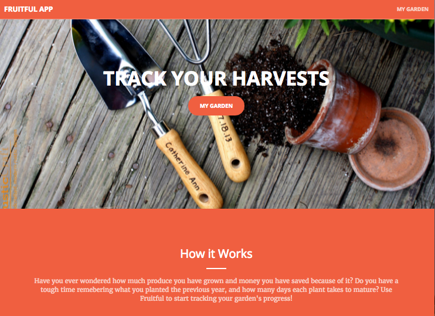

# FRUITFUL-APP:
Helping vegetable gardeners visualize their harvests.

Website:  https://fruitful-app.herokuapp.com/
User stories & wireframes: https://trello.com/b/2CoIh27m

This app was created in 5 days as a self-directed project for General Assembly's Web Development Immersive Course.

Have you ever wondered how much produce you have grown and money you have saved because of it?  Do you have a tough time remebering what you planted the previous year, and how many days each plant takes to mature? Use Fruitful to start tracking your garden's progress!  My goal is to turn this into a mint.com for garden enthusiasts. 

This is a MEAN stack web app (Mongodb, Express, Angular.js, Node.js).  Other technologies used include Chart.js & Bootstrap. 

Installation instructions:  
1. fork and clone this repo
2. in the command line run "npm install" to get all dependencies outlined in the 
   package.json file

To do: I would like to add user authentication.